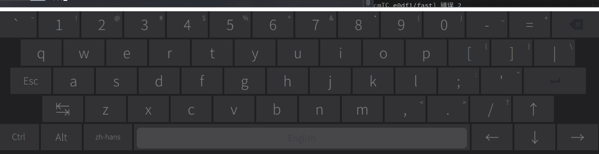
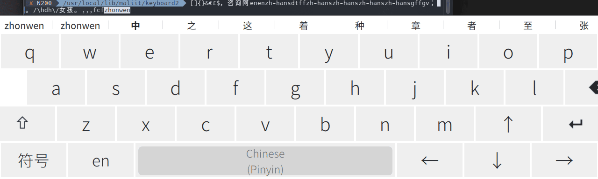
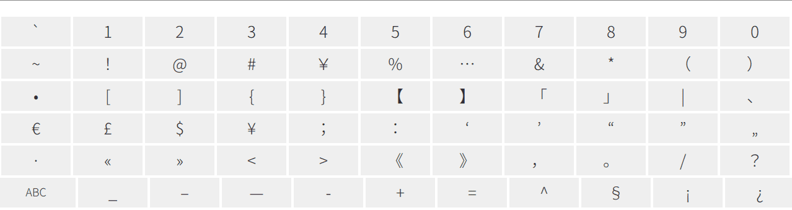

# Introduce

modify support Tab Ctrl Meta Alt Chinese

**英文键盘**



**中文键盘**



**中文符号键盘**



# Install

```bash
git clone https://github.com/liuyaocool/maliit-keyboard.git --depth=1
cd maliit-keyboard
mkdir build
cd build
cmake ..
make
sudo make install

# replace
sudo mv /usr/bin/maliit-keyboard /usr/bin/maliit-keyboard.bak
sudo ln -s /usr/local/bin/maliit-keyboard /usr/bin/maliit-keyboard
```

# 支持拼音

**Arch Linux**

```bash
sudo pacman -S libpinyin
# 执行 Install
```
